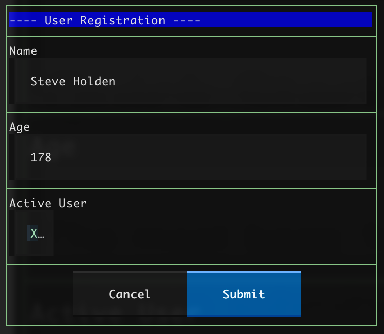

# Textual Forms

A declarative, extensible forms library for [Textual](https://textual.textualize.io/) TUI applications.

## Features/Goals

- **Declarative Syntax**: Define forms using class-based field declarations
- **Flexible Widget Assignment**: Use different widgets for the same field type
- **Easy to Extend**: Add custom field types and widgets with clear patterns
- **Built-in Validation**: Uses standard textual validators
- **Simple Integration**: Drop forms into existing Textual apps with minimal code


## Warnings

This package is in a late alpha stage.
No details should be regarded as final, particularly naming details.
Nevertheless we believe it is sufficiently close to its
final form to be put to practical use,
the feedback from which will inform further development.

LLMs have been used in the development of this package, which has since been subjected to serious scrutiny by a seasoned professional programmer.
Some of the remaining tests are of dubious value, and they will ultimately be removed.

## Installation

The package will be released to PyPI at version 0.8, at the time of writing in alpha.
Until then, install from this repository as follows.

```bash
python -m pip install textual_forms@git+https://github.com/holdenweb/textual-forms.git
```

`uv` users can use

```bash
uv add textual_forms@git+https://github.com/holdenweb/textual-forms.git
```

## Quick Start

The most basic forms contain one or more fields. When a form is submitted a
`Form.Submitted` event is posted, whose `form` attribute allows access to
values using field names. Here's a simple example.

```python
from textual_forms import Form, StringField, IntegerField, BooleanField

class UserForm(Form):
    """Simple user registration form"""
    name = StringField(label="Name", required=True)
    age = IntegerField(label="Age", min_value=0, max_value=130)
    active = BooleanField(label="Active User")
```

With a little styling this is how the rendered form appears after it's been filled out.



Fields are named from the class variable to which they are assigned (in the
example above, "name", "age" and "active"). With the content shown the
form's `get_data` method will return `{'name': 'Steve Holden', 'age': 178;
'active': True}`. Note that the integer field has been converted to an
`int`, and the Boolean field to a `bool`.

Forms are themselves reusable components so a form can contain sub-forms, as
demonstrated in the `nested_once_form.py` example, to as many levels as
required.

A form can optionally be given a prefix, which is prepended to the names of
its fields with a "_" suffix. This lets you include multiple instances of the
same sub-form, as the `nested_twice_form.py` example demonstrates.

In the event of two fields receiving the same (fully-qualified) name an
exception is raised when the form is created.

When a form is rendered "Cancel" and "Submit" buttons are added at the
bottom of the form. When clicked these buttons raise `Form.Cancelled`
and `Form.Submitted` events respectively; each has a `form` attribute
which can be used to access the form.
This behaviour will be more onfigurable in later releases.

## Form Data

Once rendered, the simplest way to access the form's data is
by calling its `get_data` method.
This returns a dictionary where fields values are keyed by the
fields' fully-qualified names (i.e. including any sub-form prefixes,
with underscores separating the named components).

Users may find that in dealing with complex nested forms it
becomes tedious to use fully-qualified names.
An experimental `get_field` method takes a string argument. If that string is
the fully-qualified name of a field, or if there is only one field whose
fully-qualified name ends an underscore followed by the string, then it
returns a field object whose attributes include `name` and `value`.

This access mechanism is perhaps the most fluid part of the current design,
and discussions (feel free to raise a Github issue to start a discussion -
we'll move it into Discussions if it looks like developing) are encouraged.
For example, would it more usable to implement a read/write property with
dotted access? Should alternatives be offered?

## Current Field Types

- `StringField` - Text input (single line)
- `TextField` - Text input (multi-line)
- `IntegerField` - Integer input with validation
- `BooleanField` - Checkbox
- `ChoiceField` - Select dropdown

Documentation of the foundational classes (Forms, Fields and Widgets) is the
biggest current technical debt. The `examples` directory
contains some code that we hope will help you to evalute textual_forms
and help shape its direction with your feedback.
Additional example programs, particularly those demonstrating the
styling possibilities, would be especially valuable.

## Running Examples

If you have `uv` installed you can run the examples from the repository using the command

`uvx --from git+https://github.com/holdenweb/textual-forms.git python examples/<name>`

where `<name>` is taken from the following table.

| name                                | Description                                      |
|:------------------------------------|:-------------------------------------------------|
| `basic_form.py`                     | A simple form with basic fields                  |
| `advanced_form.py`                  | A more complex form with validations             |
| `user_registration.py`              | Form integrated with other components            |
| `nested_once_form.py`               | Simple nested form demonstration                 |
| `nested_twice_form.py`              | Demonstrating form component re-use              |

In a clone of the repository the command `uv run examples/<name>` should suffice.

`poetry` users should find that they can build a distribution (wheel and
sdist) of the project with `poetry build`. There has been no further testing
of other development environments.

## Development

```bash
# Create a venv with dev dependencies
uv venv

# Run tests
uv run pytest

 Run specific test
uv run pytest tests/test_fields.py -v
```

## Architecture

The library uses a three-layer architecture:

1. **Fields** - Handle data conversion and validation logic
2. **Widgets** - Handle UI rendering and user interaction
3. **Forms** - Coordinate fields and widgets into complete forms

No detailed architecture documentation is presently available.

## License

MIT License - see LICENSE file for details.

## Choice Field Format

When using `ChoiceField`, provide choices as a list of `(value, label)` tuples:

```python
country = ChoiceField(
    label="Country",
    choices=[
        ("us", "United States"),  # value, label
        ("uk", "United Kingdom"),
        ("ca", "Canada"),
    ]
)
```

- The **value** (first element) is what gets stored in the form data
- The **label** (second element) is what the user sees in the dropdown

When the form is submitted, `form.get_data()['country']` will contain the
value (e.g., `"us"`), not the label.

## Older versions

The prehistory of the project is preserved in the `prototype` branch,
a somewhat chaotic mishmash of code that nevertheless proved the basic ideas
embodied in the current design to be usable in practice.
